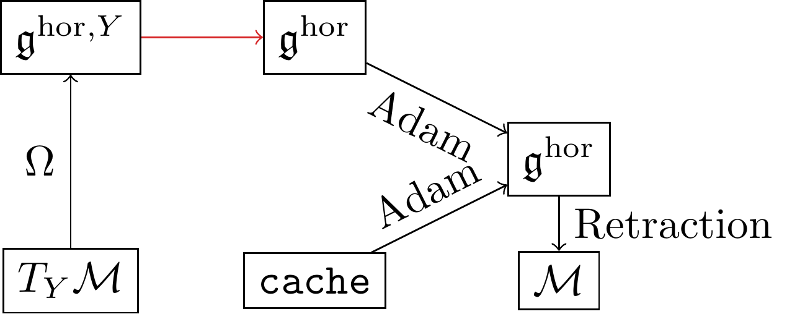

# Optimizer

In order to generalize neural network optimizers to **homogeneous spaces**, a class of manifolds we often encounter in machine learning, we have to find a [global tangent space representation](arrays/stiefel_lie_alg_horizontal.md) which we call $\mathfrak{g}^\mathrm{hor}$ here. 

Starting from an element of the tangent space $T_Y\mathcal{M}$[^1], we need to perform two mappings to arrive at $\mathfrak{g}^\mathrm{hor}$, illustrated in the following:

Here the mapping $\Omega$ is a [horizontal lift](optimizers/manifold_related/horizontal_lift.md) from the tangent space onto the **horizontal component of the Lie algebra at $Y$**. 

The red line maps the horizontal component at $Y$, i.e. $\mathfrak{g}^{\mathrm{hor},Y}$, to the horizontal component at $\mathfrak{g}^\mathrm{hor}$.

The $\mathrm{cache}$ stores information about previous optimization steps and is dependent on the optimizer. The elements of the $\mathrm{cache}$ are also in $\mathfrak{g}^\mathrm{hor}$. Based on this the optimer ([Adam](optimizers/adam_optimizer.md) in this case) a final velocity is then computed, which is the input of a [retraction](optimizers/manifold_related/retractions.md) that then finally updates the network parameters. 

[^1]: In practice this is obtained by first using an AD routine on a loss function $L$, and then computing the Riemannian gradient based on this. See the section of the [Stiefel manifold](manifolds/stiefel_manifold.md) for an example of this.