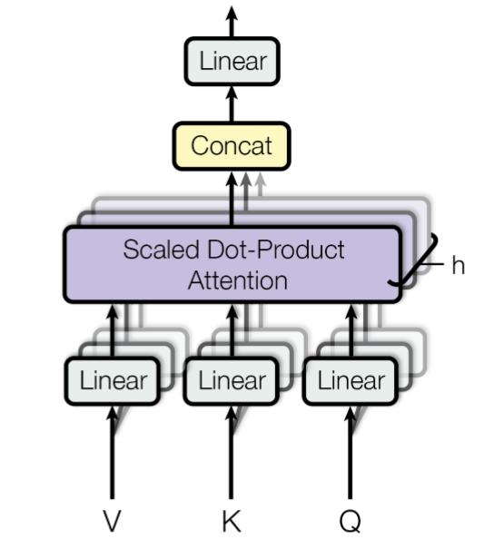

# Multihead Attention Layer

In order to arrive from the [attention layer](attention_layer.md) at the **multihead attention layer** we have to do a few modifications: 

Note that these neural networks were originally developed for natural language processing (NLP) tasks and the terminology used here bears some resemblance to that field. 
The input to a multihead attention layer typicaly comprises three components:

1. Values $V\in\mathbb{R}^{n\times{}T}$: a matrix whose columns are **value vectors**, 
2. Queries $Q\in\mathbb{R}^{n\times{}T}$: a matrix whose columns are **query vectors**, 
3. Keys $K\in\mathbb{R}^{n\times{}T}$: a matrix whose columns are **key vectors**.

Regular attention performs the following operation: 

```math
\mathrm{Attention}(Q,K,V) = V\mathrm{softmax}(\frac{K^TQ}{\sqrt{n}}),
```

where $n$ is the dimension of the vectors in $V$, $Q$ and $K$. The softmax activation function here acts column-wise, so it can be seen as a transformation $\mathrm{softmax}:\mathbb{R}^{T}\to\mathbb{R}^T$ with $[\mathrm{softmax}(v)]_i = e^{v_i}/\left(\sum_{j=1}e^{v_j}\right)$. The $K^TQ$ term is a similarity matrix between the queries and the vectors. 

The transformer contains a **self-attention mechanism**, i.e. takes an input $X$ and then transforms it linearly to $V$, $Q$ and $K$, i.e. $V = P^VX$, $Q = P^QX$ and $K = P^KX$. What distinguishes the multihead attention layer from the singlehead attention layer, is that there is not just one $P^V$, $P^Q$ and $P^K$, but there are several: one for each **head** of the multihead attention layer. After computing the individual values, queries and vectors, and after applying the softmax, the outputs are then concatenated together in order to obtain again an array that is of the same size as the input array:



Here the various $P$ matrices can be interpreted as being projections onto lower-dimensional subspaces, hence the designation by the letter $P$. Because of this interpretation as projection matrices onto smaller spaces that should **capture features in the input data** it makes sense to constrain these elements to be part of the Stiefel manifold.   

## References 
- Vaswani, Ashish, et al. "Attention is all you need." Advances in neural information processing systems 30 (2017).