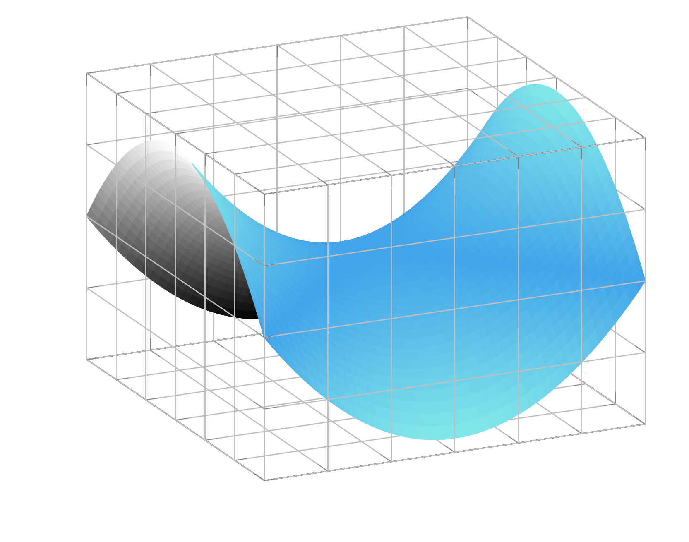

# Reduced Order modeling and Autoencoders 

Reduced order modeling is a data-driven technique that exploits the structure of parametric PDEs to make solving those PDEs easier.

Consider a parametric PDE written in the form: $F(z(\mu);\mu)=0$ where $z(\mu)$ evolves on a infinite-dimensional Hilbert space $V$. 

In modeling any PDE we have to choose a discretization (particle discretization, finite element method, ...) of $V$, which will be denoted by $V_h$. 

## Solution manifold 

To any parametric PDE we associate a **solution manifold**: 

```math 
\mathcal{M} = \{z(\mu):F(z(\mu);\mu)=0, \mu\in\mathbb{P}\}.
```



In the image above a 2-dimensional solution manifold is visualized as a sub-manifold in 3-dimensional space. In general the embedding space is an infinite-dimensional function space.

As an example of this consider the 1-dimensional wave equation: 

```math
\partial_{tt}^2q(t,\xi;\mu) = \mu^2\partial_{\xi\xi}^2q(t,\xi;\mu)\text{ on }I\times\Omega,
```
where $I = (0,1)$ and $\Omega=(-1/2,1/2)$. As initial condition for the first derivative we have $\partial_tq(0,\xi;\mu) = -\mu\partial_\xi{}q_0(\xi;\mu)$ and furthermore $q(t,\xi;\mu)=0$ on the boundary (i.e. $\xi\in\{-1/2,1/2\}$).

The solution manifold is a 1-dimensional submanifold: 

```math
\mathcal{M} = \{(t, \xi)\mapsto{}q(t,\xi;\mu)=q_0(\xi-\mu{}t;\mu):\mu\in\mathbb{P}\subset\mathbb{R}\}.
```

If we provide an initial condition $u_0$, a parameter instance $\mu$ and a time $t$, then $\xi\mapsto{}q(t,\xi;\mu)$ will be the momentary solution. If we consider the time evolution of $q(t,\xi;\mu)$, then it evolves on a two-dimensional submanifold $\bar{\mathcal{M}} := \{\xi\mapsto{}q(t,\xi;\mu):t\in{}I,\mu\in\mathbb{P}\}$.

## General workflow

In reduced order modeling we aim to construct a mapping to a space that is close to this solution manifold. This is done through the following steps: 

1. Discretize the PDE.

2. Solve the discretized PDE for a certain set of parameter instances $\mu\in\mathbb{P}$.

3. Build a reduced basis with the data obtained from having solved the discretized PDE. This step consists of finding two mappings: the **reduction** $\mathcal{P}$ and the **reconstruction** $\mathcal{R}$.

The third step can be done with various machine learning (ML) techniques. Traditionally the most popular of these has been **Proper orthogonal decomposition** (POD), but in recent years **autoencoders** have also become a popular alternative (see (Fresca et al, 2021)). 

## References 

- Fresca, Stefania, Luca Dede, and Andrea Manzoni. "A comprehensive deep learning-based approach to reduced order modeling of nonlinear time-dependent parametrized PDEs." Journal of Scientific Computing 87 (2021): 1-36.